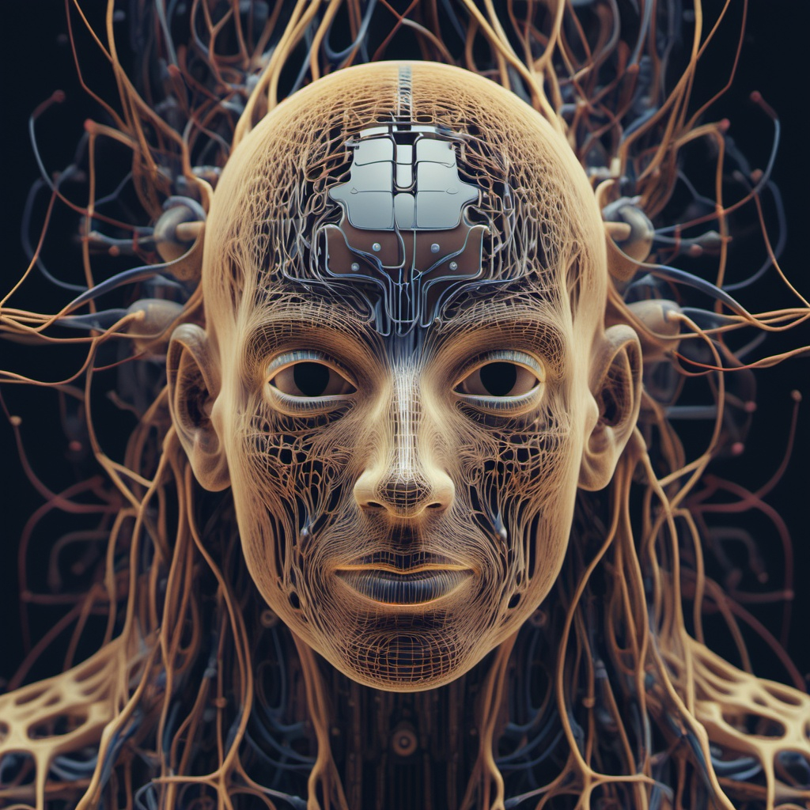

## Presentaciones

- **B-prop**. Una [presentación en pdf](intro-rn.pdf) con las nociones básicas desde la filosofía de las plataformas de diferenciación automática como TensorFlow o pyTorch
- **CNN**. Una [presentación en pdf](convolucionales.pdf) con la arquitectura básica de las redes neuronales convolucionales (CNN)
- **Transferencia de aprendizaje**. ¿Por qué podemos usar modelos preentrenados? En [esta presentación en pdf](transfer_learning-2.pdf) queremos dar alguna intuición de porqué.

## Libretas para el taller

- [**Introducción a TensorFlow**](https://colab.research.google.com/github/juliowaissman/intro-rn/blob/main/tf_intro.ipynb)
  
- [**Mi primer red neuronal en TensorFlow**](https://colab.research.google.com/github/juliowaissman/intro-rn/blob/main/mnist_densa.ipynb)
  
- [**Mi primer CNN en TensorFlow**](https://colab.research.google.com/github/juliowaissman/intro-rn/blob/main/mnist_cnn.ipynb)
  
- [**Transferencia del aprendizaje**](https://colab.research.google.com/github/juliowaissman/intro-rn/blob/main/transfer.ipynb)

## Enlaces interesantes

- No se puede vivir y hacer *deep learning* si no utilizamos regularmente el sitio de [*papers with code*](https://paperswithcode.com). Código, tutriales, onjuntos de datos, modelos preentrenados,...

- Uno de los lugares con los mejores modelos preentrenados es la compañía [*Hugging Face*](https://huggingface.co).

## Libros y documentación a profundidad

- El libro [*Deep Learning*](https://www.deeplearningbook.org) de Ian Goodfellow, Yoshua Bengio y Aaron Courville gratuito en linea con material adicional.

- [*NeurIPS*](https://nips.cc), la conferencia más importante en redes neuronales.

- [*Journal of Machine Learning Research*](https://jmlr.org) es una publicación libre muy completa sobre el último grito de la moda en ML. Muy buenos artículos, pero bastante más densos. 

## Cursos 

- Un [excelente curso](http://introtodeeplearning.com) de introducción al aprendizaje profundo del MIT con videos. transparencias y código.